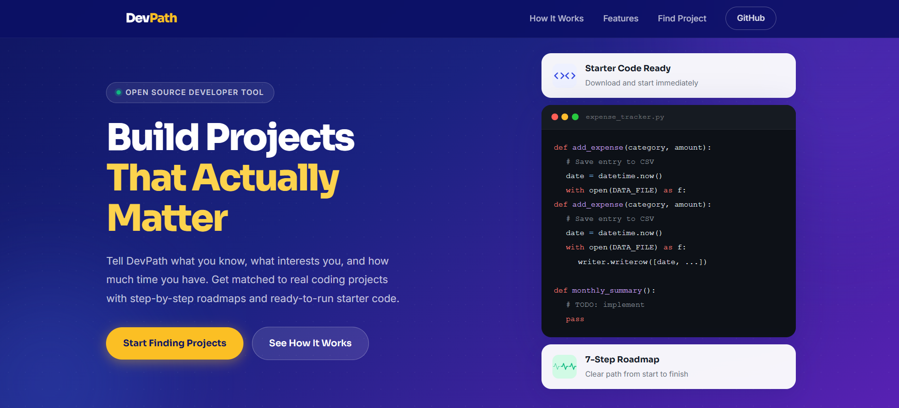
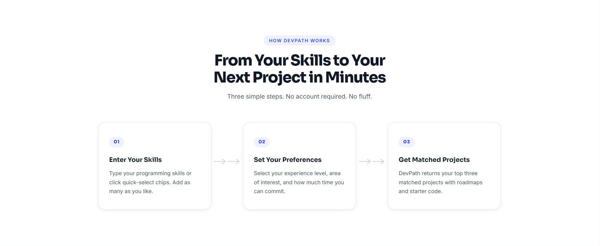
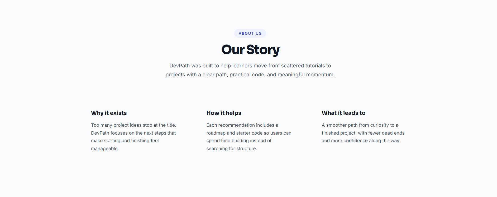
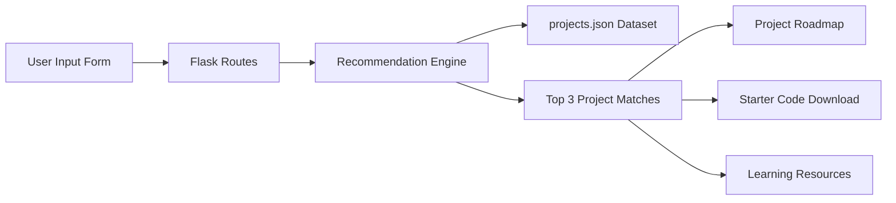

<div align="center">



<br/>

# DevPath

### Skill to Project Recommender

*Find your next coding project in under 30 seconds.*

<br/>

[](https://www.python.org/)
[](https://flask.palletsprojects.com/)
[](LICENSE)
[](#quick-start)
[](CONTRIBUTING.md)
[](https://gssoc.girlscript.tech/)

<br/>

[](https://github.com/komalharshita/devpath/issues)
[](https://github.com/komalharshita/devpath/network/members)
[](https://github.com/komalharshita/devpath/stargazers)
[](https://github.com/komalharshita/devpath/graphs/contributors)

<br/>

[Get Started](#quick-start) &nbsp;&bull;&nbsp;
[Features](#features) &nbsp;&bull;&nbsp;
[How It Works](#how-it-works) &nbsp;&bull;&nbsp;
[Contribute](#contributing) &nbsp;&bull;&nbsp;
[Docs](docs/) &nbsp;&bull;&nbsp;
[Discussions](https://github.com/komalharshita/devpath/discussions)

<br/>

---

</div>

## Screenshots

<div align="center">




</div>

---

## Why DevPath Exists

Most beginner developers complete tutorials but struggle with the next step:
**what to build on their own.**

DevPath was created to solve that problem.

Instead of endlessly searching for project ideas, users can enter their
skills, interests, experience level, and available time to instantly get
personalized project recommendations with:

- Step-by-step roadmaps
- Curated learning resources
- Beginner-friendly starter code
- Clear progression paths

The goal is simple:

> Help developers move from “learning syntax” to “building real projects.”

---

## Features

| Feature | Description |
|----------|-------------|
| Personalized recommendations | Matches projects based on skills, level, interest, and time |
| Rule-based scoring engine | Transparent and explainable recommendation logic |
| Beginner-friendly architecture | Small, modular, and easy to understand |
| Starter code templates | Downloadable boilerplate code for projects |
| Guided roadmaps | Structured learning and implementation flow |
| Open-source contribution ready | Designed for GSSoC and beginner contributors |

---

## Tech Stack

<div align="center">


</div>

---

## How It Works

```text
User inputs                 Scoring engine              Output
-----------                 --------------              ------
Skills (Python, HTML)  -->  +3 per skill match   -->   Top 3 projects
Level (Beginner)       -->  +2 if level matches         with:
Interest (Data)        -->  +2 if interest matches       - Roadmap
Time (Low)             -->  +1 if time matches           - Resources
                                                          - Starter code
```

The algorithm lives entirely in `utils/recommender.py`. Weights are named
constants at the top of the file — easy to tune without reading the whole module.

---

## Architecture



---

## Quick Start

```bash
git clone https://github.com/komalharshita/devpath.git
cd devpath
python -m venv venv
source venv/bin/activate          # Windows: venv\Scripts\activate
pip install -r requirements.txt
python app.py
```

**http://127.0.0.1:5000** — that is the entire setup.

```bash
# Verify everything works
python tests/test_basic.py
# 27 passed, 0 failed out of 27 tests
```

---

## Project Structure

```text
devpath/
├── app.py                   Entry point (30 lines)
├── routes/main_routes.py    5 HTTP routes as a Blueprint
├── utils/
│   ├── data_loader.py       Reads projects.json
│   ├── recommender.py       Scores + filters projects
│   └── file_server.py       Serves starter code safely
├── data/projects.json       Project dataset (extend this)
├── templates/               Jinja2 HTML
├── static/                  CSS + vanilla JS
├── starter_code/            7 starter templates
├── tests/test_basic.py      27 tests
└── docs/                    Architecture + contribution guides
```

---

## Routes

| Method | Path | Returns |
|--------|------|---------|
| GET | `/` | Homepage with skill form |
| POST | `/api/recommend` | JSON — top 3 matched projects |
| GET | `/project/<id>` | HTML — full project detail page |
| GET | `/project/<id>/code` | JSON — starter code content |
| GET | `/project/<id>/download` | File — starter code download |

---

## Extending the Dataset

The dataset is a plain JSON file. Add a new project by appending to
`data/projects.json`:

```json
{
  "id": 8,
  "title": "Todo CLI App",
  "skills": ["Python"],
  "level": "Beginner",
  "interest": "Automation",
  "time": "Low",
  "description": "A command-line task manager that saves to JSON.",
  "features": ["Add/remove tasks", "Mark complete", "Filter by status"],
  "tech_stack": ["Python", "json module"],
  "roadmap": ["Step 1: Define data structure", "Step 2: Write add_task()"],
  "resources": ["Python docs: https://docs.python.org"],
  "starter_code": "starter_code/todo_cli.py"
}
```

No backend changes needed. The engine picks it up on the next request.

---

## First Timers Welcome

New to open source? This project is designed for beginners.

Start here:

- Look for issues labeled `good first issue`
- Read `CONTRIBUTING.md`
- Ask questions in Discussions
- Follow the PR template
- Start with documentation or UI improvements

Maintainers review beginner PRs with guidance and feedback.

---

## Contributing

<div align="center">

[](https://github.com/komalharshita/devpath/issues)
[](https://github.com/komalharshita/devpath/issues?q=label%3A%22good+first+issue%22)

</div>

This project is designed to be contributed to. The codebase is small,
modular, and thoroughly documented. If this is your first open-source
contribution, this is a good place to start.

**Step-by-step process:**

```text
1. Browse issues          github.com/komalharshita/devpath/issues
2. Comment to claim       Leave a comment before starting
3. Fork the repo          Fork button on GitHub
4. Create a branch        git checkout -b feat/your-change
5. Make the change        Follow the code style in CONTRIBUTING.md
6. Run tests              python tests/test_basic.py
7. Push and open a PR     Use the template in CONTRIBUTING.md
```

**Branch naming:**

```text
feat/description          New feature
fix/description           Bug fix
docs/description          Documentation only
data/description          New projects in the dataset
style/description         CSS or visual changes
test/description          Test additions or fixes
```

---

## GSSoC 2026

<div align="center">

[](https://gssoc.girlscript.tech)

</div>

DevPath is an active GSSoC 2026 project. Contributions are mentored and
welcomed at all skill levels.

Before starting work: comment on the issue, then fork and branch. Do not
open a PR for an issue that is not assigned or claimed in the comments.

Read the full onboarding guide: [docs/contribution_guide.md](docs/contribution_guide.md)

---

## Community & Support

Have questions, ideas, or feature suggestions?

- Open a discussion:
  https://github.com/komalharshita/devpath/discussions
- Report bugs through Issues
- Suggest new project ideas
- Help improve beginner onboarding

Community contributions and feedback are always welcome.

---

## Contributors

Thanks to all the amazing people who contribute to DevPath.

<div align="center">

<a href="https://github.com/komalharshita/devpath/graphs/contributors">
  
</a>

</div>

---

## Documentation

| Document | Description |
|----------|-------------|
| [README.md](README.md) | This file — setup, structure, contributing |
| [CONTRIBUTING.md](CONTRIBUTING.md) | Code style, branch naming, PR template |
| [CODE_OF_CONDUCT.md](CODE_OF_CONDUCT.md) | Community standards |
| [docs/architecture.md](docs/architecture.md) | System design and data flow |
| [docs/contribution_guide.md](docs/contribution_guide.md) | Beginner onboarding (8 steps) |
| [docs/project_overview.md](docs/project_overview.md) | What DevPath is and why |
| [docs/github_issues.md](docs/github_issues.md) | All 12 issues with full descriptions |

---

## Code of Conduct

All contributors are expected to follow the
[Contributor Covenant Code of Conduct](CODE_OF_CONDUCT.md).

---

## License

MIT — see [LICENSE](LICENSE)

---

<div align="center">

<br/>

*DevPath — open source, built for learners, by learners.*

<br/>

</div>
